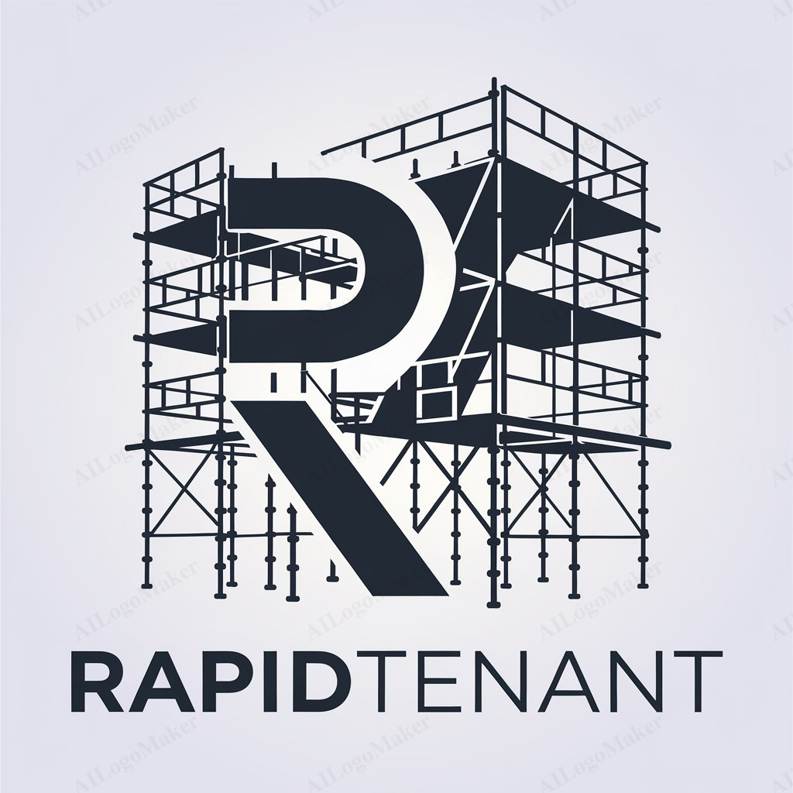

<p align="center">
  
</p>

# Contributing to RapidTenant

Thank you for your interest in contributing to **RapidTenant**! We appreciate your help in improving this project. Here are some guidelines to follow when contributing.

## Code of Conduct

By participating in this project, you are expected to uphold our [Code of Conduct](CODE_OF_CONDUCT.md). Please take a moment to review it.

## How Can You Contribute?

There are many ways you can contribute to **RapidTenant**:

1. **Bug Reports**: Found a bug? Please submit an issue with as much detail as possible. Include:
   - A clear description of the problem.
   - Steps to reproduce the issue.
   - Screenshots (if applicable).
   - Any error messages or logs.

2. **Feature Requests**: If you have an idea for a new feature, feel free to open a feature request issue. Be sure to explain:
   - The problem your feature would solve.
   - How it could be implemented or suggestions for its design.

3. **Code Contributions**: If you'd like to fix a bug or implement a feature, follow the steps below to get started.

## Getting Started

### 1. Fork the Repository

First, fork the repository to your GitHub account by clicking the "Fork" button on the repository page.

### 2. Clone Your Fork

Once forked, clone your repository locally:

```bash
git clone https://github.com/your-username/rapid-tenant.git
cd rapid-tenant
```

### 3. Create a Branch

Create a new branch for your feature or bug fix:

```bash
git checkout -b feature/YourFeatureName
```

Make sure to give your branch a descriptive name that indicates the purpose of your changes.

### 4. Make Changes

Make your changes to the codebase. Follow the established coding standards and best practices used throughout the project.

### 5. Commit Your Changes

Once your changes are ready, stage and commit them:

```bash
git add .
git commit -m "Description of your changes"
```

Be sure to write clear, concise commit messages that describe your changes.

### 6. Push to Your Fork

Push your branch to your forked repository:

```bash
git push origin feature/YourFeatureName
```

### 7. Open a Pull Request

Once pushed, open a pull request on the main **RapidTenant** repository. Your pull request should:

- Clearly describe the changes you've made.
- Reference any related issue numbers (e.g., `Fixes #123`).
- Include any relevant screenshots or documentation updates.

We'll review your pull request and provide feedback if necessary. Please be patient, as reviewing contributions may take some time.

## Coding Guidelines

To ensure consistency and quality in the project, please follow these coding guidelines:

1. **PHP Standards**: Follow [PSR-12](https://www.php-fig.org/psr/psr-12/) coding standards for PHP code.
2. **Commit Messages**: Write clear, concise commit messages.
3. **Testing**: If your change affects code logic or functionality, add or update tests to ensure reliability.
4. **Documentation**: For new features or significant changes, update or add documentation as needed.

## License

By contributing to **RapidTenant**, you agree that your contributions will be licensed under the [MIT License](LICENSE).

---

Thank you for contributing to **RapidTenant**! Your contributions help improve the project for everyone.

