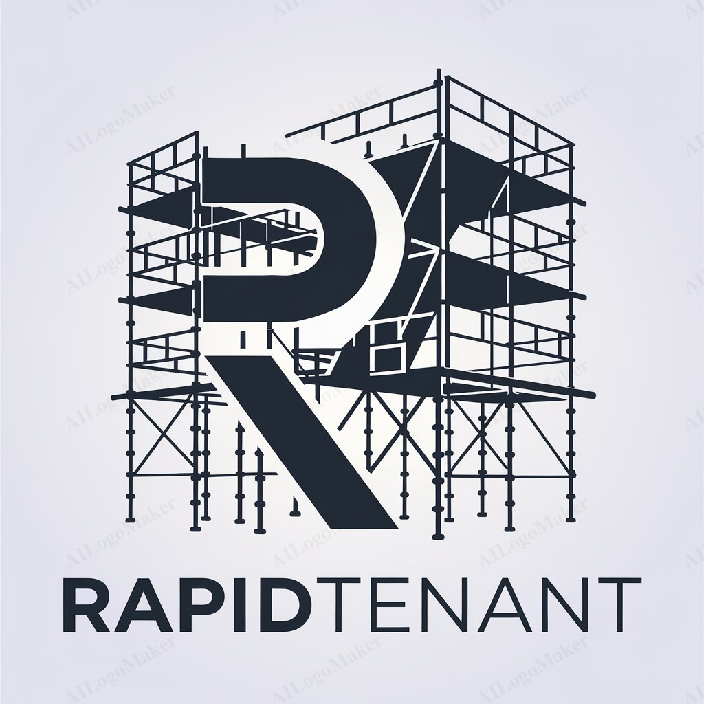

<p align="center">
  
</p>

# RapidTenant

## Overview

**RapidTenant** is a scaffolding solution designed to accelerate the development of multi-tenancy applications using Laravel. It is built to help developers quickly set up robust, scalable applications with tenant management, user authentication, and role-based access control (RBAC).

With **RapidTenant**, you can skip the foundational setup and focus directly on developing your core application features. The project is split into two parts:

1. **Central App**: Handles tenant management, such as creating, updating, or deleting tenants.
2. **Tenant App (Client)**: Each tenant operates within their own isolated environment, equipped with user and role-permission management.

Key features include:

- **Multi-Database Tenancy**: Supports tenant separation through individual databases.
- **Domain/Subdomain Awareness**: Each tenant can be accessed via a unique domain or subdomain.
- **Role & Permission Management**: Fine-grained access control using roles and permissions per tenant.
- **Filament Integration**: User-friendly administrative panel with Filament.

---

### Installation

#### Prerequisites

Before you begin, ensure you have the following installed on your system:

- **PHP 8.2+**
- **Composer** (Dependency Manager for PHP)
- **Laravel Valet** (Optional, for Mac users)
- **Laravel** (Framework, included in the setup)
- **MySQL/PostgreSQL** (Database for tenant management)
- **Node.js & NPM** (for building front-end assets)

#### Steps to Install

1. **Clone the Repository**  
   First, clone the repository to your local machine:
   ```bash
   git clone https://github.com/awsasongko/rapid-tenant.git
   cd rapid-tenant
   ```

2. **Install Composer Dependencies**  
   Install all required PHP dependencies via Composer:
   ```bash
   composer install
   ```

3. **Install NPM Dependencies**  
   Next, install front-end dependencies for any CSS or JS components:
   ```bash
   npm install && npm run build
   ```

4. **Environment Setup**  
   Copy the example `.env` file and adjust the configuration:
   ```bash
   cp .env.example .env
   ```

   Update the following environment variables:
   - **APP_NAME**: `RapidTenant`
   - **APP_URL**: Change to your local URL (e.g., `APP_URL=rapidtenant.test`).
   - **DB_CONNECTION, DB_DATABASE, DB_USERNAME, DB_PASSWORD**: Configure for your main database.
   - **SESSION_DRIVER**: Set to `file`.

   Set up additional keys if necessary, such as `MAIL`, `QUEUE_CONNECTION`, etc.

5. **Generate Application Key**  
   Run the following command to generate an encryption key for the application:
   ```bash
   php artisan key:generate
   ```

6. **Run Migrations and Seed the Database**  
   Run the database migrations to set up the system tables:
   ```bash
   php artisan migrate --seed
   ```

7. **Run the Application Locally**

   - **For Laravel Valet Users**:  
     If you are using Laravel Valet, link the project to Valet so that you can access it easily via a `.test` domain.
     ```bash
     valet link rapidtenant
     valet secure rapidtenant
     ```

     After running the commands, you can access the app at `https://rapidtenant.test`.

   - **For Non-Valet Users**:  
     Run the built-in Laravel server:
     ```bash
     php artisan serve
     ```

     Then, open your browser and go to `http://localhost:8000`.

#### Additional Notes for Valet Users
If you prefer to use Laravel Valet for handling local domains and HTTPS, Valet will automatically manage SSL certificates and serve the app from the `.test` domain. You can add more tenants by configuring separate subdomains or domains via Valet, which is helpful for **RapidTenant's** multi-tenancy feature.

---

### Usage
Once you have successfully installed and set up **RapidTenant**, you can start using its key features. Below are some common tasks you might want to perform:

#### 1. Managing Tenants
To create, update, or delete tenants, navigate to the **Tenant Management** section in the admin panel. Here’s how to do it:
- **Create a Tenant**:  
  In the admin panel, click on the "Add Tenant" button. Fill in the required details, such as the tenant's name and domain. Upon creation, the application automatically generates a **super user** for the tenant. This user will have full administrative privileges to manage the tenant's application settings. After saving, you can log in to the tenant app using this super user account.
- **Update a Tenant**:  
  Select the tenant from the list and click on the "Edit" button. Make your changes and save.
- **Delete a Tenant**:  
  To delete a tenant, select the tenant from the list and click the "Delete" button. Confirm the action to remove the tenant and delete the tenant's database.

#### 2. User Management
Each tenant has its own user base. To manage users:
- **Add a User**:  
  Within the tenant's dashboard, go to the "Users" section and click "Add User". Fill in the user's information, assign roles, and save.
- **Edit a User**:  
  Select a user from the list, click "Edit", make the necessary changes, and save.
- **Assign Roles**:  
  While adding or editing a user, you can assign specific roles to them. Roles define the permissions the user will have within the tenant.

#### 3. Role & Permission Management
Manage roles and permissions through the **Roles** section in the admin panel:
- **Create a Role**:  
  Click on "Add Role", define the role's name and permissions, and save.
- **Edit a Role**:  
  Select a role from the list and click "Edit" to modify its permissions.
- **Assign Roles to Users**:  
  During user creation or editing, assign the appropriate roles to control access levels.

#### 4. Accessing the Tenant Application

Each tenant can access their application via their unique domain or subdomain. Ensure that you have set up the necessary DNS records pointing to your server for each tenant's domain. 
Example:  
- Tenant 1: `https://tenant1.rapidtenant.test`
- Tenant 2: `https://tenant2.rapidtenant.test`

The super user created during tenant setup can log in to the tenant application using their credentials. This super user can then configure additional settings for the tenant app.

#### 5. Additional Features
- **Role-Based Access Control**: Users can only see what they are allowed to see based on their assigned roles.
- **Multi-Tenancy**: Each tenant operates independently with their own data, ensuring privacy and security.

---

### Contributing

We welcome contributions to **RapidTenant**! If you'd like to contribute, please follow these guidelines:

1.  **Fork the Repository**: Create a copy of the repository.
2.  **Clone Your Fork**: Clone the forked repository locally.
3.  **Create a Branch**: Work on a new feature or bug fix in a dedicated branch.
4.  **Make Your Changes**: Ensure they follow the project's coding standards.
5.  **Commit & Push**: Commit your changes and push them to your fork.
6.  **Open a Pull Request**: Describe your changes and submit the PR.

For detailed contributing guidelines, please refer to the [Contributing](CONTRIBUTING.md) file.

Thank you for contributing to **RapidTenant**!

---
### Code of Conduct
Please adhere to the project's [Code of Conduct](CODE_OF_CONDUCT.md) to ensure a respectful and collaborative environment for all contributors.

---
### License

This project is licensed under the MIT License. See the [LICENSE](LICENSE) file for more details.

---
### Security Policy

If you discover a security vulnerability, please create an issue in our [GitHub repository](https://github.com/awsasongko/rapid-tenant/issues). Ensure that the issue contains all necessary information regarding the vulnerability so we can address it promptly. For more details, refer to the [Security Policy](SECURITY.md).

---
### Issue Templates

For bugs, feature requests, or questions, please use the appropriate issue templates found in the ISSUE_TEMPLATE directory. This ensures that all necessary information is provided and can speed up the resolution process.

---

### Pull Request Template

Before submitting your pull request, make sure it adheres to the project's Pull Request Template. This helps maintain code quality and project standards.

---
### Acknowledgments

Thank you to all contributors for your support and contributions to **RapidTenant**! Your efforts and feedback are greatly appreciated and help improve the project for everyone.

### Contributors
- **Filament Team** ([filamentphp](https://github.com/filamentphp)): For the `filament` package, enabling a user-friendly administrative panel.
- **Bezhan Salleh** ([bezhanSalleh](https://github.com/bezhanSalleh)): For the `filament-shield` package, which provides role and permission management.
- **Samuel Štancl** ([stancl](https://github.com/stancl)): For the `stancl/tenancy` package, which handles multi-database tenancy.
- **Rafael Ramos** ([rmsramos](https://github.com/rmsramos)): For implementing multi-database tenancy with Filament, ensuring it aligns with the purpose of this project.

A special thanks to the open-source community and the Laravel ecosystem ([laravel](https://github.com/laravel)) for providing the tools and resources that make this project possible.
